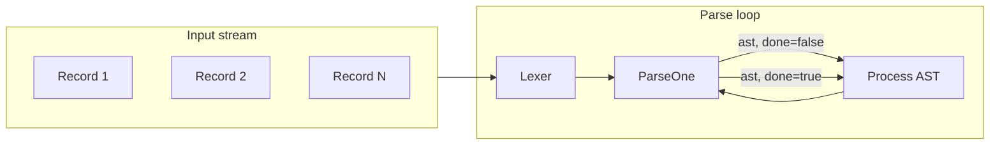

# Streaming one-record parsing (pgpg + json-stream)

## Why 2.json fails today

- Grammar in [json.bnf](json.bnf) has start symbol `Json ::= Value` (one value).
- [main.go](main.go) calls `parser.Parse(lexer, "")` once; the generated parser accepts only when lookahead is **EOF** (see [generated/parsers/myparser.go](generated/parsers/myparser.go) state 2 and `MyParserActionAccept`).
- For 2.json, after the first `{ "a":1, "b":2 }` the lookahead is the next token (e.g. whitespace then `{`), not EOF, so there is no action for that token and the parser returns "parse error: unexpected ...".

So the grammar is already "one record"; the missing piece is **accept after one record without requiring EOF** and then **resume from the same stream** for the next record.

## Approach

- Keep the **grammar unchanged** (one record per start symbol).
- Add a **ParseOne**-style API that:
  - Parses until the start symbol is reduced (one record).
  - If lookahead is EOF: return (AST, done).
  - If lookahead is not EOF: return (AST, not done) and **do not consume** that lookahead so the next call continues from it (stash lookahead in the parser).
- Caller loop: create one lexer for the whole input; repeatedly call ParseOne until done; process each AST (e.g. print, decode, send downstream) before parsing the next. That gives streaming behavior: one record at a time, without needing to parse the entire file before handling the first.

True streaming from an `io.Reader` (so a 1M-record file is not fully read into memory) can be a later step; the lexer currently takes a full string, and the same ParseOne loop will work once you add a streaming lexer that implements the same `AbstractLexer` interface.

---

## 1. Changes in pgpg (parser generator)

You own pgpg; these are the mods that make one-record streaming possible.

### 1.1 Table generator (`parsegen-tables`)

- **Identify the "accept" state(s):** states that have an action `accept` on EOF (e.g. state 2 in [myparser.json](generated/parsers/myparser.json)).
- **Add "accept-and-yield" for non-EOF tokens:** For each such state, for every token type that is **not** EOF, emit an action (e.g. `accept_and_yield`) so the parser can stop after one record and return the current lookahead for the next record.
- **Optional:** Make this behavior conditional (e.g. flag or grammar pragma like `!streaming` or `!multi_record`) so existing single-document use stays "accept only on EOF" if desired.

### 1.2 Code generator (`parsegen-code`)

- **New action kind:** e.g. `AcceptAndYield` (or equivalent in your naming).
- **Parser state:** Add a field to hold **stashed lookahead** (e.g. `stashedLookahead *tokens.Token`). When `AcceptAndYield` is taken, set this to the current lookahead and return the AST; do not call `lexer.Scan()` for that token so the next parse reuses it.
- **ParseOne API:** e.g. `ParseOne(lexer liblexers.AbstractLexer, astMode string) (ast *asts.AST, done bool, err error)`:
  - **First token:** If `parser.stashedLookahead != nil`, use it as lookahead and clear it; otherwise `lookahead = lexer.Scan()`.
  - **Loop:** Same shift/reduce logic as current `Parse`, but:
    - On **Accept** (EOF): return `(ast, true, nil)`.
    - On **AcceptAndYield**: set `parser.stashedLookahead = lookahead`, return `(ast, false, nil)`.
  - **Error:** return `(nil, false, err)` as today.
- **Backward compatibility:** Keep existing `Parse(lexer, astMode)` unchanged (accept only on EOF) so existing callers do not change.

### 1.3 Lexer (optional, for true streaming later)

- Today the generated lexer takes a single string. For "read from file/network without loading everything," pgpg could later add a lexer that reads from `io.Reader` (or a small buffer) and implements the same `AbstractLexer` interface. Not required for the "one record at a time" loop with a string or preloaded buffer.

---

## 2. Changes in json-stream (this repo)

- **Regenerate parser** after pgpg is updated (`./generate.sh`).
- **Replace single `Parse` with a loop** in [main.go](main.go):
  - For file or stdin: create one lexer over the full input (or, later, over a streaming reader).
  - Loop: call `parser.ParseOne(lexer, "")`; if error, exit; if `ast == nil && done`, exit; if `ast != nil`, process it (e.g. `ast.Print()`); if `done`, break; otherwise continue for the next record.
- **Result:** `./jsonp 2.json` (and `./jsonp N.json` with many objects) works: each object is parsed and handled in turn; no need to load or parse the entire file before processing the first object.

---

## 3. Summary diagram

---

## 4. Other formats (CSV, TSV, list-of-JSON)

- **Same idea:** Grammar defines **one record** (one CSV row, one JSON value, etc.). No need to encode "many records" in the grammar.
- Use **ParseOne** in a loop on a single shared lexer; optionally add a **record separator** in the grammar (e.g. newline for line-based formats) so the lexer doesn't need to know record boundaries.
- If you add the optional streaming lexer in pgpg, the same pattern applies: one lexer over `io.Reader`, repeated `ParseOne`, process each record as it arrives.

---

## 5. What to implement first

1. **pgpg:** Table generator change (accept-and-yield in accept state for non-EOF) and code generator change (new action, stashed lookahead, `ParseOne`).
2. **json-stream:** After pgpg is released/updated, regenerate and switch to the ParseOne loop so `./jsonp 2.json` works and the pattern is ready for CSV/TSV and true streaming later.
